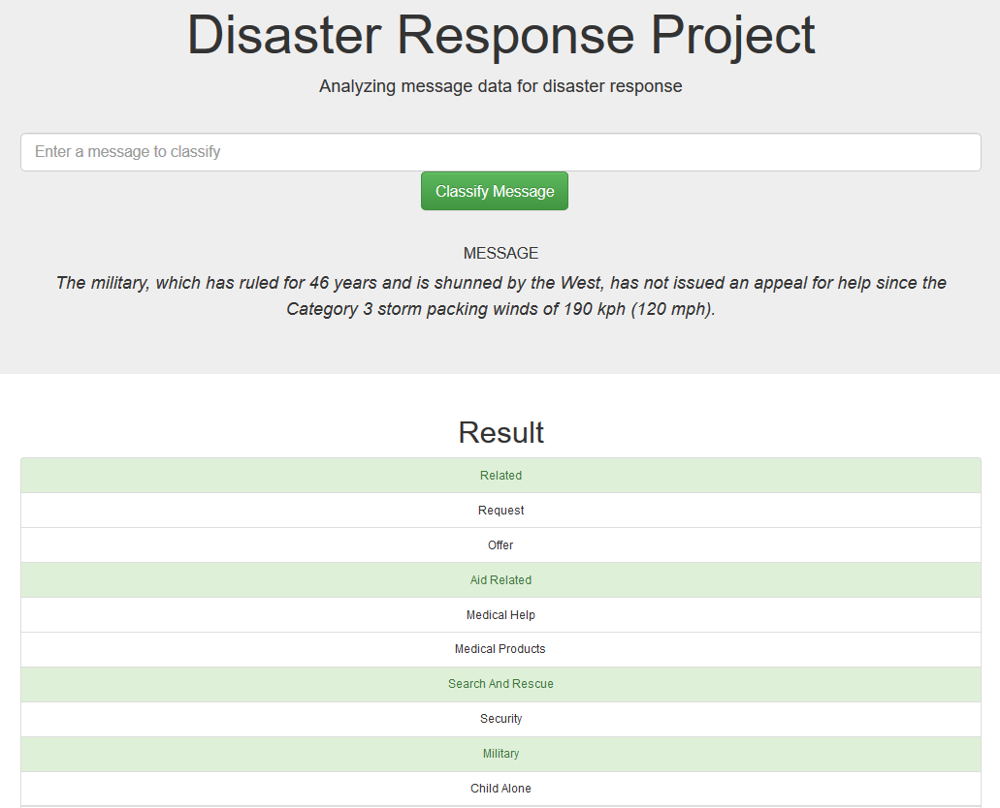

# Disaster Response Pipeline Project

### Overview

In this project, we analyze the disaster data from [Figure Eight](https://www.figure-eight.com/) to build a model that classifies disaster messages.

The data set contains real messages that were sent during disaster events. We will create a machine learning pipeline to categorize these events so that one can send the messages to an appropriate disaster relief agency.

The project will include a web app where an emergency worker can input a new message and get classification results in several categories. The web app will also display visualizations of the data.

### Web App Screenshots




### Description of Files

```
- [app]
| - [template]
| |- master.html            # main page of web app
| |- go.html                # classification result page of web app
|- run.py                   # Flask file that runs app

- [data]
|- disaster_categories.csv  # data to process
|- disaster_messages.csv    # data to process
|- process_data.py          # Python script for ETL pipeline
|- DisasterResponse.db      # database to save clean data to

- [models]
|- train_classifier.py      # Python script for ML pipeline

- README.md
```

### Instructions:

1. Run the following commands in the project's root directory to set up your database and model.

    - To run ETL pipeline that cleans data and stores in database
        `python data/process_data.py data/disaster_messages.csv data/disaster_categories.csv data/DisasterResponse.db`
    - To run ML pipeline that trains classifier and saves
        `python models/train_classifier.py data/DisasterResponse.db models/classifier.pkl`

2. Run the following command in the app's directory to run your web app.
    `python run.py`

3. Go to http://0.0.0.0:3001/

### Observations:

We can see from the visualizations that the data set is highly imbalanced (with very few class 1 samples). This affects the model prediction power especially on class 1. To improve the model performance, we may need to address the imbalance by methods such as up-sampling, down-sampling or creating synthetic data.